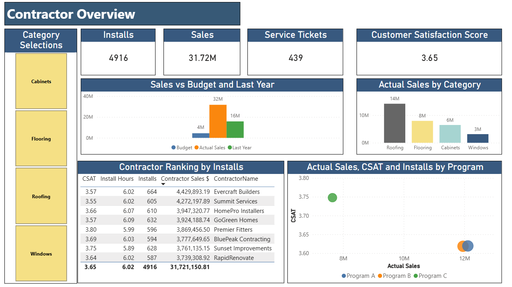

# 🏠 Home Improvement Retail Dashboard

## 📌 Project Overview
This project showcases an interactive Home Improvement Retail Dashboard built in Power BI. The dashboard consolidates contractor, retailer, and product performance metrics into one view, enabling stakeholders to track sales, installations, service quality, and customer satisfaction while supporting data-driven decisions across programs.

## 🔎 Key Features
- **Contractor Reporting** – KPIs for Sales $, Installations, Service Tickets, and CSAT
- **Performance Comparisons** – YoY trends, Budget vs Actual, and Peer benchmarks (same program)
- **24 Months of Data** – Sep 2023 to Aug 2025 for reliable trend analysis

## 🛠️ Tools & Techniques
- Power BI for data modeling and interactive visualization
-	Power Query for cleaning and transforming source files
-	DAX for advanced calculations (e.g., YoY, Budget mapping, RLS lookups)
-	CSV Data Model (sample fact and dimension tables provided)
-	GitHub for portfolio documentation and sharing

## 🎯 Purpose
To demonstrate how retail and contractor performance data can be transformed into actionable insights through interactive dashboards. This project highlights the value of analytics in improving operational efficiency, tracking program performance, and enhancing customer satisfaction in the home improvement industry.

##  Files Included

- `Home_Improvement_Retail_Dashboard.pbix` — Power BI dashboard file  
- `DimContractor.csv` — Sample or anonymized dataset  
- `DimDate.csv` — Sample or anonymized dataset  
- `DimProduct.csv` — Sample or anonymized dataset  
- `DimRetailer.csv` — Sample or anonymized dataset  
- `FactBudget.csv` — Sample or anonymized dataset  
- `FactInstallations.csv` — Sample or anonymized dataset  
- `FactSales.csv` — Sample or anonymized dataset  
- `FactService.csv` — Sample or anonymized dataset  
- `SecurityMap.csv` — Sample or anonymized dataset  
- `visuals_mapping.csv` — Sample or anonymized dataset  
- `HIRD.png` — image
- `Contractor_Overivew.mp4` – Dashboard Video  
- `README.md` — Project documentation (this file)

## 📊 Sample Visual

## 📊 Sample Video Demonstration
▶️ [Watch on YouTube]( https://youtu.be/udmyjITtP_w)

## 🗂️ Project Status

✅ Complete – Ready for demonstration and portfolio inclusion  

## 📫 Contact
Catherine McKillips

[LinkedIn](https://www.linkedin.com/in/catherine-mckillips-data-analytics)  

## 📧 Email
cathymckillips@gmail.com

